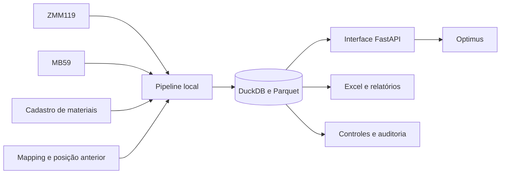

# Projetos

Repositório de projetos desenvolvidos para automatizar processos, organizar dados e criar rotinas auditáveis. Cada projeto fica em uma pasta própria, com código, documentação técnica, instruções de instalação e arquivos necessários para adaptação a outros contextos.

## Projetos disponíveis

### Vektor

Ecossistema modular em Google Apps Script que reúne governança financeira, análises, automações, páginas operacionais e assistentes de IA. O portal integra frentes de cartão corporativo, Numerário, Contas a Receber/Prosegur, POS, agentes de IA e painéis de Power BI.

A versão pública contém os 19 arquivos do projeto Apps Script e documenta os serviços avançados e bibliotecas associados. IDs, e-mails, URLs internas, política corporativa e dados operacionais foram removidos ou substituídos por configurações de ambiente.

**Tecnologias:** Google Apps Script, JavaScript, HTML/CSS, Google Sheets, Google Drive, Gmail API, BigQuery, Vertex AI e Power BI.

- [Código, módulos e instalação](vektor/README.md)
- [Arquitetura do ecossistema](vektor/docs/arquitetura.md)
- [Módulos e fluxos operacionais](vektor/docs/modulos.md)
- [Dados e integrações](vektor/docs/dados-integracoes.md)
- [Configuração para uma nova implantação](vektor/docs/configuracao.md)
- [Segurança da versão pública](vektor/docs/seguranca.md)

---

### SmartSlip

Aplicação web em Google Apps Script para receber comprovantes financeiros, organizar arquivos no Google Drive, extrair informações com Gemini e acompanhar filas, histórico, indicadores, alertas e custos de inteligência artificial.

O projeto oferece uma interface responsiva para computador e celular, controle de acesso por usuário e loja, processamento auditável e persistência em Google Sheets. A versão pública foi sanitizada: não contém a planilha persistente, IDs, e-mails, URLs internas ou dados operacionais.

**Tecnologias:** Google Apps Script, JavaScript, HTML, CSS, Google Sheets, Google Drive, Gemini API e Gmail API.

- [Código, funcionalidades e instalação](smartslip/README.md)
- [Arquitetura e fluxo](smartslip/docs/arquitetura.md)
- [Segurança da versão pública](smartslip/docs/seguranca.md)

---

### Estoque Contábil

Plataforma local em Python e FastAPI para processar posições contábeis de estoque, automatizar extrações do SAP, consolidar regras de negócio e disponibilizar consultas e análises em uma interface web executada na máquina do usuário.

#### O problema

O processo dependia de planilhas pesadas, fórmulas distribuídas e etapas manuais para reunir posição de estoque, movimentos de materiais, cadastros e regras contábeis. Isso aumentava o tempo de processamento e dificultava a rastreabilidade dos resultados.

#### A solução

1. Recebe ou extrai as bases necessárias do SAP.
2. Valida os contratos de colunas e a competência processada.
3. Consolida posição de estoque, movimentos, cadastro de materiais, mapeamentos e posição anterior.
4. Armazena a base compilada localmente em DuckDB.
5. Disponibiliza visão analítica, relatórios, auditoria, diagnóstico e consultas assistidas pelo Optimus.
6. Gera arquivos de saída e evidências rastreáveis por execução.



#### Principais recursos

- Processamento local de bases contábeis de grande volume.
- Extração assistida de transações SAP com a sessão já autenticada.
- Consolidação por competência com validações de origem e estrutura.
- Mapeamentos editáveis para aging, planta, lifecycle e status operacional.
- Relatórios, exportações e histórico de execução.
- Health Center para diagnóstico do ambiente e das bases.
- Optimus para consultas contábeis apoiadas em evidências da base compilada.
- Instalador versionado para distribuição em outras máquinas.
- Ponte de sincronização para competências compiladas entre instalações.

#### Tecnologias

**Python** · **FastAPI** · **DuckDB** · **Parquet** · **pandas** · **openpyxl** · **SAP GUI Scripting** · **n8n** · **HTML e JavaScript**

#### Estrutura

```text
estoque-contabil/
├── src/                 # aplicação, API, pipeline, integrações e interface
├── tests/               # testes automatizados
├── config/              # fontes, contratos, parâmetros e regras
├── installer/           # criação e manutenção do instalador
├── n8n/                 # workflows e instruções do agente
├── tools/               # utilitários de documentação, build e verificação
├── README.md            # início rápido e operação do projeto
├── ARQUITETURA_FINAL.md # arquitetura e limites de homologação
├── MAPEAMENTO_DADOS.md  # campos, fórmulas e regras mapeadas
└── Especificacao_Tecnico_Documental_Estoque_Contabil.docx
```

#### Documentação

- [Código e início rápido](estoque-contabil/README.md)
- [Especificação técnico documental](estoque-contabil/Especificacao_Tecnico_Documental_Estoque_Contabil.docx)
- [Arquitetura final](estoque-contabil/ARQUITETURA_FINAL.md)
- [Mapeamento de dados](estoque-contabil/MAPEAMENTO_DADOS.md)
- [Manual operacional usado pelo sistema](estoque-contabil/src/ops_contabil/knowledge/manual_sistema.md)

#### Reutilização

O projeto foi organizado para permitir adaptação a outra operação, área ou empresa. Os contratos de entrada, caminhos, parâmetros, regras de mapeamento e integrações ficam separados do núcleo de processamento. Credenciais e dados operacionais devem permanecer fora do repositório e ser configurados no ambiente de cada implantação.

---

Desenvolvido por [Rodrigo Lisboa](https://github.com/rodrigolisboa25-create).
