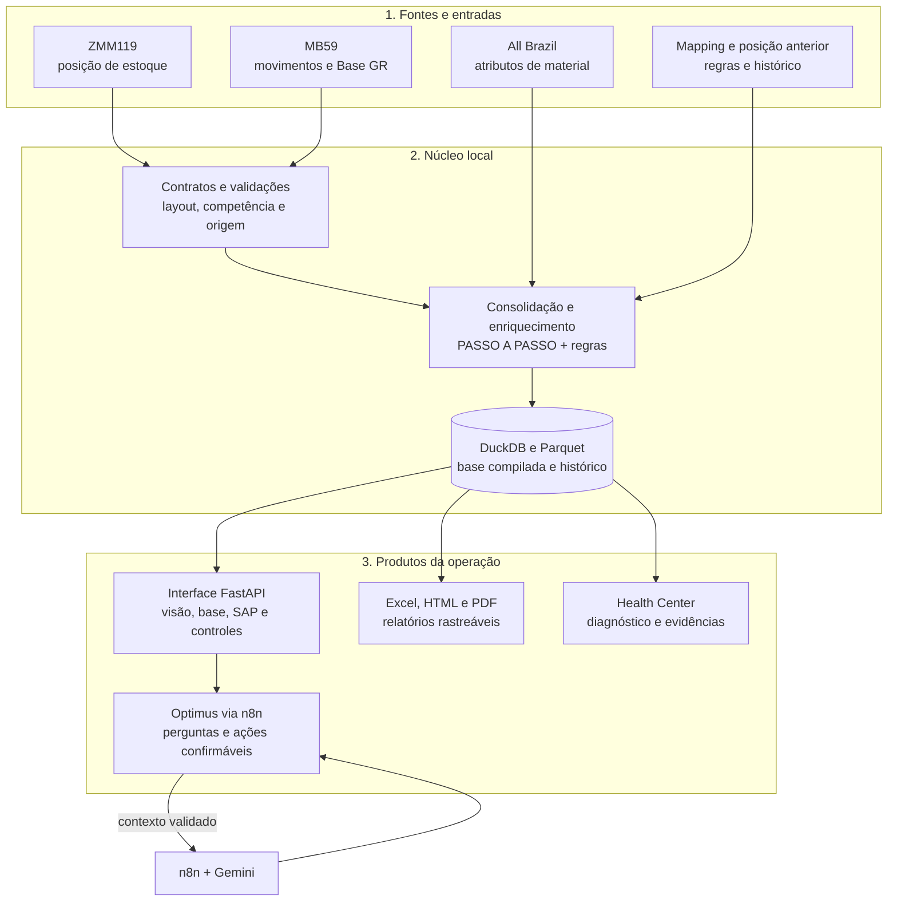

# 📦 Estoque Contábil

**Python + FastAPI + DuckDB + Parquet + SAP GUI + n8n + Google Gemini**

Plataforma local para transformar posições de estoque, movimentos SAP, cadastros e regras contábeis em uma base auditável. O sistema substitui planilhas pesadas como motor de cálculo, mantém o processamento na máquina da operação e oferece análises, relatórios, controles e o agente de IA **Optimus**.

> Projeto organizado para reutilização em outras áreas, escopos ou empresas. Credenciais, bases operacionais e arquivos de produção devem ser configurados em cada implantação.

## 📌 O problema

O processo original dependia de planilhas grandes, fórmulas repetidas, buscas manuais e várias etapas para conciliar a posição de estoque com movimentos, cadastro de materiais e regras contábeis. Esse desenho dificultava:

- processar competências de grande volume;
- saber qual fonte originou cada campo enriquecido;
- comparar uma competência com a anterior;
- identificar centros, materiais ou regras sem cobertura;
- separar falha técnica de divergência de negócio;
- reproduzir o mesmo resultado em outra máquina;
- responder perguntas sem abrir várias planilhas.

## ✅ A solução

1. Recebe ou extrai do SAP as bases ZMM119 e MB59 da competência.
2. Valida o layout, o contrato de colunas, a empresa e a data-base antes de aceitar a carga.
3. Consolida posição de estoque, movimentos, cadastro All Brazil, Mapping e posição anterior.
4. Aplica o PASSO A PASSO por campo para recuperar Product Offer End, Season e Year com rastreabilidade da fonte.
5. Grava a base compilada localmente em DuckDB e Parquet para consultas rápidas e reprocessamento controlado.
6. Disponibiliza uma interface web FastAPI com visão analítica, base detalhada, extrações, controles e Health Center.
7. Usa o **Optimus**, agente de IA integrado ao n8n, para responder perguntas com contexto validado e evidências da competência.
8. Gera Excel, relatórios, HTML compartilhável e PDF com os mesmos gráficos da aplicação.
9. Registra execuções, auditoria, pendências, backups e sincronização entre instalações.
10. Distribui uma versão consistente por instalador, preservando os dados locais mais novos em atualizações.



## 🤖 Optimus: agente de IA via n8n

O **Optimus** é o agente contábil do sistema e um dos principais produtos desta arquitetura. Ele não recebe a base bruta inteira nem acessa credenciais SAP. A API local prepara o contexto e o workflow n8n conduz a conversa com o Google Gemini.

### Como a conversa funciona

1. O usuário abre a página Optimus e informa a competência, por exemplo `2026-08`.
2. A API local monta um contexto com KPIs, `run_id`, status, insights, regras, Mapping, All Brazil, competências disponíveis e trechos do manual.
3. O backend chama o Chat Trigger do n8n com a sessão, a pergunta, o usuário e a competência.
4. O n8n valida o período, consulta `/api/agent/context` com token e entrega o payload ao agente Gemini.
5. O agente responde somente com os dados recebidos e pode pedir consultas locais pelo protocolo `[[OPS_ACTION]]`.
6. O backend executa a consulta autorizada, devolve o resultado ao n8n e apresenta a resposta na interface.

### O que o Optimus consulta

- valor fiscal, quantidade, PMM, aging, lifecycle, origem, divisão, local e centro;
- comparação entre competências carregadas e variações relevantes;
- lacunas da Base de Estoque e centros sem regra no Mapping;
- status de ZMM119, MB59, execuções e enriquecimento All Brazil;
- documentação técnica, manual operacional e instruções de uso do sistema;
- Health Center, conectividade VPN/n8n e situação de backup;
- PDF da Visão e relatórios e payload factual para apresentação executiva.

### Ações protegidas

Extrações SAP, importações, reprocessamento, alterações de Mapping, sincronização, backup, acessos e preferências não são executados diretamente pela pergunta. O Optimus primeiro apresenta um resumo, guarda uma pendência e só executa depois de uma confirmação explícita. Usuários comuns não recebem ações administrativas.

O agente também acompanha eventos proativos: falhas de extração, planilhas disponíveis para importação, lacunas de enriquecimento, centros sem regra, mudanças de qualidade, jobs travados e quedas ou retornos de VPN/n8n. O sistema detecta o fato; o Optimus escreve a orientação para o administrador.

O fluxo completo, o contrato de contexto, as ferramentas, os limites e a configuração do workflow estão em [docs/optimus.md](docs/optimus.md).

## 🧩 Funcionalidades

- Processamento local de grandes bases contábeis sem Streamlit ou BigQuery.
- Extração assistida de ZMM119 e MB59 com SAP GUI já autenticado.
- Validação de layout, contratos de coluna, empresa, competência e data-base.
- Enriquecimento por All Brazil, PASSO A PASSO, Mapping e posição anterior.
- Reprocessamento dos joins sem reler a ZMM119 quando uma regra é corrigida.
- Visão analítica com aging, lifecycle, origem, centros, locais, PMM e composição de custos.
- Base detalhada com filtros, pendências de joins e exportação XLSX.
- Filtros combináveis por divisão, centro, local de estoque e season em todos os indicadores da Visão e relatórios.
- Mapa mental interativo que explora os dados já calculados para a competência e os filtros selecionados.
- Totais das colunas de quantidade e valor na Base de Estoque, considerando todas as linhas filtradas.
- Catálogo All Brazil que descobre automaticamente novos anos e meses nas pastas configuradas.
- Mapping compartilhado entre instalações, com histórico de alterações, exclusões e recálculo local das competências afetadas.
- Controles, auditoria, histórico de execuções e Health Center.
- Optimus com n8n/Gemini, memória curta de conversa e ferramentas locais.
- Relatórios HTML autônomos, PDF e payload para apresentações executivas.
- Ponte de dados para sincronizar competências entre instalações autorizadas.
- Backup programado, restauração controlada e instalador versionado.

### 🔎 Visão e relatórios

O usuário pode combinar valores de **Division Description, Centro, Local de estoque e Season**. A seleção atualiza os cards, gráficos, PMM, evolução e comparações com a competência anterior. As etiquetas abaixo do título mostram os filtros ativos. O **Mapa mental** abre uma exploração dos mesmos indicadores, com ramos para valor e giro, aging, divisões, localização, coleções, evolução e composição do custo. Tanto os filtros quanto o mapa usam o resumo da competência carregada; o HTML compartilhável e o PDF continuam representando a competência inteira.

Na matriz **Aging for Season**, a coluna e a linha Total mostram as somas por ano e season; a comparação com o ano anterior aparece ao passar o mouse. Na **Base de Estoque**, a linha `Σ TOTAL` ou `Σ FILTRO` soma quantidades e valores de todas as linhas correspondentes à busca e aos filtros, mesmo quando a grade está paginada.

### 🔄 Cadastros e regras entre instalações

A biblioteca **All Brazil** lê as pastas reais organizadas por ano e mês. Um mês novo aparece no catálogo sem edição de uma lista fixa; os links configurados continuam servindo para abrir pastas conhecidas no Drive.

No **Mapping compartilhado**, cada instalação registra suas alterações em um arquivo próprio. As instalações autorizadas unem as regras pela alteração mais recente, preservam exclusões e recalculam as competências locais quando recebem uma regra que muda o resultado. O painel exibe a situação da sincronização. Essa função depende da ponte de dados configurada em cada implantação.

## 🛠️ Stack

**Python** · **FastAPI** · **DuckDB** · **Parquet** · **pandas** · **openpyxl** · **SAP GUI Scripting** · **HTML/CSS/JavaScript** · **n8n** · **Google Gemini**

## 📁 Estrutura

```text
estoque-contabil/
├── src/                 # API, pipeline, regras, telas e ferramentas locais
├── config/              # caminhos, contratos, parâmetros SAP e regras
├── n8n/                 # workflows importáveis e instruções do Optimus
├── docs/                # documentação complementar, incluindo o Optimus
├── installer/           # pacote, atualização e distribuição
├── tests/               # testes automatizados
├── tools/               # utilitários de documentação, build e validação
├── sql/                 # consultas e estruturas de apoio
├── apps_script/         # ponte de dados e integrações Google, quando habilitadas
├── README.md            # visão geral, instalação e operação
├── ARQUITETURA_FINAL.md # decisões técnicas e limites de homologação
└── MAPEAMENTO_DADOS.md  # campos, fórmulas e regras mapeadas
```

## 🚀 Início rápido

### Instalação distribuída

1. Um administrador gera o pacote `INSTALAR_ESTOQUE_CONTABIL.zip` na página **Configurações**.
2. O pacote é enviado por canal corporativo e extraído integralmente na máquina de destino.
3. O usuário executa `INSTALAR_ESTOQUE_CONTABIL.bat`.
4. O instalador encontra ou instala Python 3.13, cria o ambiente virtual, instala dependências e publica o runtime local.
5. O sistema cria o atalho **Estoque Contábil** na Área de Trabalho.
6. O usuário abre a aplicação em `http://127.0.0.1:8765` e valida o Health Center.

O runtime fica em `%LOCALAPPDATA%\OpsContabil\runtime\app`, os dados compilados em `%LOCALAPPDATA%\OpsContabil\processed` e os logs em `%LOCALAPPDATA%\OpsContabil\logs`. Atualizações preservam identidade, preferências e dados operacionais locais mais novos.

### Execução manual para desenvolvimento

```powershell
$venv = "$env:LOCALAPPDATA\OpsContabil\runtime\.venv"
py -3.12 -m venv $venv
& "$venv\Scripts\python.exe" -m pip install --upgrade .
& "$venv\Scripts\python.exe" -m ops_contabil.runtime_entry doctor
& "$venv\Scripts\python.exe" -m uvicorn ops_contabil.dashboard_runtime:app --host 127.0.0.1 --port 8765
```

Para habilitar o Optimus, configure `N8N_CHAT_URL` na instalação e os parâmetros `OPS_API_BASE_URL` e `OPS_API_TOKEN` no ambiente do n8n. O procedimento detalhado está em [n8n/PUBLICAR_AGENTE_GEMINI.md](n8n/PUBLICAR_AGENTE_GEMINI.md).

## 🗃️ Dados e persistência

O sistema processa localmente as fontes recebidas, grava a base compilada em DuckDB/Parquet e mantém relatórios e evidências associados à execução. O Excel é uma entrada legada, uma carga de contingência ou um formato de entrega; ele não é o motor das regras.

As competências, Mapping, permissões e relatórios podem ser distribuídos por uma ponte de dados controlada. O HTML compartilhável é autônomo e não depende do n8n, Google Drive ou Apps Script depois de gerado.

## 🔐 Segurança e reutilização

- Credenciais do SAP permanecem na sessão autenticada do SAP GUI.
- Tokens e URLs do n8n ficam em variáveis de ambiente ou no cofre da instância n8n.
- Bases reais, PDFs, planilhas operacionais, logs e backups não devem ser versionados.
- O agente recebe agregados e evidências limitadas, não a base inteira.
- Ações que alteram dados ou iniciam processamento exigem confirmação e respeitam o perfil do usuário.
- Para adaptar o projeto, altere contratos, caminhos, Mapping, regras e integrações na configuração da nova implantação sem reescrever o núcleo de processamento.

## 📚 Documentação

- [Especificação técnico-documental](Especificacao_Tecnico_Documental_Estoque_Contabil.docx)
- [Optimus e integração n8n](docs/optimus.md)
- [Arquitetura final](ARQUITETURA_FINAL.md)
- [Mapeamento das bases](MAPEAMENTO_DADOS.md)
- [Manual operacional usado pelo Optimus](src/ops_contabil/knowledge/manual_sistema.md)
- [Workflow Gemini do n8n](n8n/workflows/ops_contabil_agent_gemini.json)
- [Publicação do agente Gemini](n8n/PUBLICAR_AGENTE_GEMINI.md)

Desenvolvido por [Rodrigo Lisboa](https://github.com/rodrigolisboa25-create).
