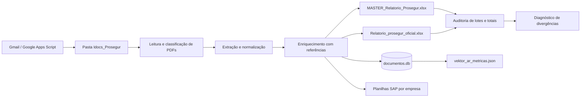

# Sistema Prosegur

**Pipeline de recebimento, leitura, conferência, auditoria e consolidação de documentos de transporte e faturamento da Prosegur.**

O Sistema Prosegur combina automação de e-mails, processamento de PDFs, extração estruturada de dados, enriquecimento com bases de referência, geração de relatórios Excel e auditoria de consistência. A solução possui uma etapa local em Python e uma etapa de integração no Google Apps Script.

> Esta é uma cópia pública e sanitizada. Os arquivos de código e configuração foram preservados; banco SQLite, PDFs, planilhas preenchidas, relatórios, métricas, logs, credenciais e dados operacionais foram deixados fora do GitHub.

## O problema que o sistema resolve

Documentos de transporte e serviços chegam em formatos diferentes, por e-mail e em lotes. A conferência manual precisa reconhecer tipos documentais, extrair números e valores, associar fornecedores e lojas, distribuir custos e montar arquivos para as etapas seguintes do processo.

Sem uma camada automatizada, o fluxo fica sujeito a:

- leitura manual de muitos PDFs;
- divergência entre nome de arquivo e conteúdo;
- notas, boletos e demonstrativos sem correspondência;
- duplicidade de documentos;
- fórmulas e rateios refeitos em cada competência;
- falta de histórico sobre o que foi recebido, processado ou rejeitado;
- dificuldade para comparar relatório oficial, master e base de origem.

## O que a solução faz

1. Recebe ou encontra documentos PDF na pasta de entrada.
2. Identifica o tipo do documento: BOL, CTe-OS, DEM ou NFSe.
3. Extrai campos estruturados usando `pdfplumber` e regras específicas por layout.
4. Normaliza datas, números, valores, CNPJ/CPF, empresas e códigos de loja.
5. Enriquece os registros com bases de fornecedores, centros de custo e lojas.
6. Persiste o resultado e a chave do documento em SQLite.
7. Gera relatórios master, oficial e arquivos SAP por empresa e competência.
8. Executa auditoria de nomes, lotes, totais, pastas e documentos esperados.
9. Disponibiliza uma análise de divergências entre as bases consolidadas.
10. Registra métricas para acompanhar volume, valores e qualidade do processamento.



## Componentes

| Componente | Responsabilidade |
| --- | --- |
| **Google Apps Script** | Pesquisa mensagens, aplica marcador, salva anexos no Drive, registra auditoria e agenda processamento |
| **`processador_pdf.py`** | Detecta o tipo documental, extrai campos e constrói `DocumentPayload` |
| **`main.py`** | Orquestra a competência, consolida dados, gera relatórios, atualiza SQLite e métricas |
| **`agente_auditoria.py`** | Confere documentos de entrada e saída, lotes, totais, nomes e divergências |
| **`ANALISE_BASE_PROSEGUR_tela.py`** | Compara master e oficial e apresenta a análise operacional |
| **`gerar_metricas_vektor.py`** | Agrega métricas do banco para acompanhamento do ecossistema Vektor |
| **`organizador.py`** | Organiza documentos em pastas conforme o período e o tipo de serviço |
| **Lançadores `.bat`** | Instala dependências, executa o robô, abre a análise e limpa artefatos locais com confirmação |
| **Código legado** | Mantém versões anteriores de leitura de e-mail, parsing e pipeline para referência histórica |

## Tipos de documento

O parser reconhece os formatos usados no fluxo Prosegur:

- **BOL:** boleto ou documento de cobrança;
- **CTe-OS:** conhecimento de transporte ou documento de serviço;
- **DEM:** demonstrativo com itens, lojas, valores, malotes e serviços;
- **NFSe:** nota fiscal de serviço;
- **UNKNOWN:** arquivo que não atendeu aos padrões conhecidos e precisa de análise.

Cada documento recebe um identificador, nome de origem, tipo, quantidade de páginas, número documental, competência, valores, partes envolvidas, impostos e campos específicos do demonstrativo quando disponíveis.

## Saídas produzidas

As saídas reais são geradas na máquina de cada implantação, dentro de pastas por competência. O processo pode produzir:

- base master consolidada;
- relatório oficial;
- relatórios SAP para as empresas configuradas;
- abas dinâmicas e pivôs;
- arquivo de auditoria;
- métricas agregadas;
- relatórios de divergência entre notas, boletos e demonstrativos.

Os nomes e contratos das saídas estão explicados em [Arquitetura e contratos](docs/arquitetura.md).

## Estrutura publicada

```text
sistema-prosegur/
├── SISTEMA_PROSEGUR/
│   ├── main.py
│   ├── processador_pdf.py
│   ├── agente_auditoria.py
│   ├── ANALISE_BASE_PROSEGUR_tela.py
│   ├── gerar_metricas_vektor.py
│   ├── Apps_Script_Prosegur_Novo.js
│   ├── requirements.txt
│   ├── Robo_Prosegur.spec
│   ├── templates/README.md
│   └── legacy/                 # versões anteriores do código
├── ANALISE_BASE_PROSEGUR.bat
├── INSTALAR_DEPENDENCIAS.bat
├── Limpar_Banco.bat
├── RODAR_ROBO_PROSEGUR.bat
├── organizador.py
├── .env.example
├── .gitignore
├── docs/
│   ├── arquitetura.md
│   ├── operacao.md
│   ├── configuracao.md
│   ├── seguranca.md
│   └── dados-excluidos.md
└── README.md
```

## Como executar em outra máquina

1. Instale Python 3.11 ou superior.
2. Copie `.env.example` para `.env` e preencha os valores localmente.
3. Crie as pastas de entrada e saída descritas na documentação.
4. Coloque os templates SAP e as bases de referência na implantação.
5. Execute `INSTALAR_DEPENDENCIAS.bat` ou `python -m pip install -r SISTEMA_PROSEGUR/requirements.txt`.
6. Coloque os PDFs autorizados em `Idocs_Prosegur`.
7. Execute `RODAR_ROBO_PROSEGUR.bat` ou `python SISTEMA_PROSEGUR/main.py`.
8. Revise o relatório, a auditoria e as métricas antes de promover as saídas.

Para uma implantação que utilize o Apps Script, publique `Apps_Script_Prosegur_Novo.js` como projeto separado, configure os IDs do Drive e os acionadores, e aponte a pasta de entrada para o ambiente correto.

## Documentação

- [Arquitetura e contratos de dados](docs/arquitetura.md)
- [Operação passo a passo](docs/operacao.md)
- [Processo operacional e SAP](docs/processo-sap.md)
- [Configuração e implantação](docs/configuracao.md)
- [Segurança e sanitização](docs/seguranca.md)
- [Dados e artefatos excluídos](docs/dados-excluidos.md)

---

Desenvolvido por [Rodrigo Lisboa](https://github.com/rodrigolisboa25-create).
