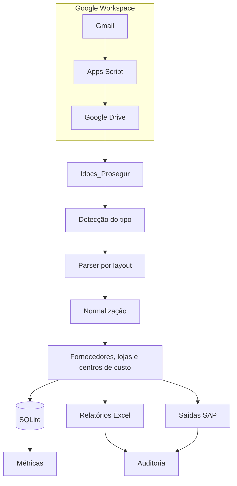

# Arquitetura e contratos de dados

## Visão geral

O sistema tem duas entradas principais: documentos baixados por automação de e-mail e documentos já disponíveis na pasta de entrada. A etapa Python trata o lote localmente; a etapa Apps Script organiza a captura e a auditoria no Google Workspace.

## Camadas

### Captura

`Apps_Script_Prosegur_Novo.js` consulta a caixa de e-mail, identifica mensagens elegíveis, salva anexos no Drive, registra a auditoria e aplica marcadores. A implementação possui funções para criar, listar e remover o acionador de processamento.

### Entrada local

`Idocs_Prosegur` é a pasta de entrada. Os nomes dos arquivos carregam pistas sobre documento, competência e lote, mas o parser tenta confirmar os campos pelo conteúdo do PDF.

### Extração

`processador_pdf.py` usa `pdfplumber` para ler o texto, detectar o tipo e extrair estruturas específicas. Os tipos são representados por `DocumentType`; partes, impostos e itens DEM são modelos tipados.

O parser também:

- normaliza valores monetários e identificadores;
- converte datas para um formato comparável;
- reconhece variações de layout;
- faz fallback pelo nome do arquivo;
- cruza número do documento com o nome recebido;
- enriquece dados por CNPJ quando uma base de referência está disponível.

### Orquestração

`main.py` coordena a competência:

1. seleciona o período;
2. lê PDFs e documentos já persistidos;
3. cria ou atualiza o banco SQLite;
4. carrega bases auxiliares;
5. monta linhas por tipo de serviço;
6. escreve a aba master e abas dinâmicas;
7. recalcula fórmulas e pivôs do template;
8. valida totais;
9. gera os relatórios por empresa;
10. dispara auditoria e métricas.

### Auditoria

`agente_auditoria.py` verifica se os documentos recebidos possuem saídas esperadas, se os nomes apontam para o período correto, se boletos e notas foram localizados e se os totais equivalentes batem entre lotes.

`ANALISE_BASE_PROSEGUR_tela.py` permite comparar o master, o relatório oficial e as divergências encontradas entre documentos.

## Principais contratos

### `DocumentPayload`

Cada PDF processado produz um payload com identificador, nome de origem, tipo, páginas e campos extraídos. Conforme o tipo, também pode conter número documental, competência, vencimento, valores, impostos, fornecedor, loja e itens do demonstrativo.

### Banco SQLite

O banco local evita reprocessamento cego e mantém documentos já conhecidos. O arquivo é criado na pasta do sistema e não deve ser versionado.

### Pastas de execução

| Pasta/arquivo | Função |
| --- | --- |
| `Idocs_Prosegur` | PDFs de entrada |
| `PROSEGUR_PROCESS` | Saídas por período e empresa |
| `SISTEMA_PROSEGUR/documentos.db` | Estado e documentos processados |
| `SISTEMA_PROSEGUR/processamento.log` | Log da execução local |
| `SISTEMA_PROSEGUR/vektor_ar_metricas.json` | Métricas agregadas |
| `SISTEMA_PROSEGUR/templates` | Modelos de relatórios SAP |
| `Bases de informações.xlsx` | Referências de fornecedores, lojas e regras |

## Saídas e reconciliação

O fluxo separa a geração das saídas da validação. O master consolida o que foi processado; o relatório oficial representa o arquivo usado pela operação; a auditoria compara quantidade, nomes, valores e correspondência entre documentos.

Uma execução só deve ser promovida quando:

- todos os tipos esperados foram reconhecidos;
- documentos desconhecidos foram revisados;
- totais do lote e da base estão coerentes;
- divergências foram explicadas;
- arquivos de saída foram gravados na competência correta.
