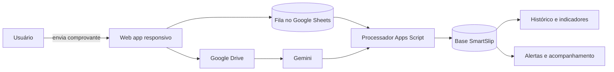

# 🧾 SmartSlip

**Google Apps Script + Gemini + Google Sheets + Google Drive**

Aplicação web para receber comprovantes financeiros, extrair informações com inteligência artificial, aplicar validações operacionais e acompanhar cada envio até a conclusão. A solução reúne envio, fila de processamento, histórico, indicadores, alertas e administração em uma interface responsiva para computador e celular.

> Versão pública e sanitizada. IDs de planilhas e arquivos, URL da implantação, e-mails, domínios corporativos e endpoints internos foram removidos. A base persistente não faz parte deste repositório: o código contém somente o contrato de integração e lê os identificadores pelas propriedades do Apps Script.

## 📌 O problema

O recebimento de comprovantes depende de arquivos enviados por diferentes lojas e usuários. Sem um fluxo central, a conferência dos documentos, a identificação de valores e períodos, o acompanhamento de falhas e a cobrança de lojas inativas ficam distribuídos entre e-mails, planilhas e controles manuais.

## ✅ A solução

1. O usuário entra com sua conta corporativa e seleciona a loja autorizada.
2. Envia um ou mais comprovantes pelo computador ou celular.
3. O arquivo é salvo no Google Drive em uma estrutura organizada por período e loja.
4. O Gemini analisa o documento e devolve dados estruturados e evidências.
5. Regras complementares validam totais, datas, duplicidade e consistência do lote.
6. O processamento é registrado em uma fila persistente no Google Sheets.
7. Histórico, indicadores, custos de IA, desempenho e alertas ficam disponíveis na própria aplicação.



## 🧩 Funcionalidades

- Controle de acesso por usuário, perfil e loja.
- Interface responsiva para desktop e celular.
- Upload em lote com acompanhamento do progresso.
- Organização automática de arquivos no Google Drive.
- Extração documental com Gemini e gateway de IA configurável.
- Pré-validação de total e perguntas complementares.
- Fila persistente com prevenção de duplicidade e controle de continuidade.
- Histórico pesquisável, reenvio controlado e exclusão auditada.
- Resumos diários e mensais, adoção por lojas e status operacionais.
- Hub de comprovantes com filtros, detalhes e exportação CSV.
- Monitoramento de desempenho e custos das chamadas de IA.
- Alertas automáticos de inatividade por tipo de operação.
- Pesquisa periódica de satisfação.
- Preferências individuais e configuração administrativa.

## 🛠️ Stack

**Google Apps Script V8** · **HTML** · **CSS** · **JavaScript** · **Google Sheets** · **Google Drive** · **Gemini API** · **Gmail API** · **Canvas API**

## 📁 Estrutura

```text
smartslip/
├── src/
│   ├── Code.gs        # backend, integrações, regras e tarefas agendadas
│   └── Index.html     # interface web responsiva
├── docs/
│   ├── arquitetura.md
│   └── seguranca.md
└── README.md
```

## 💾 Persistência

O SmartSlip usa uma planilha Google Sheets como base persistente. Ela armazena filas, resultados processados, usuários, pesquisas, custos e registros de auditoria em abas separadas. A planilha real e seu identificador não são publicados.

O código também pode consultar uma base auxiliar com informações de lojas e limites. Cada implantação deve criar suas próprias planilhas e informar os respectivos IDs nas propriedades do Apps Script.

## ⚙️ Configuração

1. Crie um projeto do Google Apps Script.
2. Adicione [`src/Code.gs`](src/Code.gs) e [`src/Index.html`](src/Index.html).
3. Crie as propriedades necessárias em **Configurações do projeto → Propriedades do script**.

| Propriedade | Uso |
| --- | --- |
| `SMARTSLIP_DB_SPREADSHEET_ID` | Planilha persistente do SmartSlip |
| `SMARTSLIP_INFO_LIMITES_SPREADSHEET_ID` | Base auxiliar de lojas e limites |
| `SMARTSLIP_FOLDER_ID` | Pasta raiz dos comprovantes no Drive |
| `SMARTSLIP_TOKEN` | Token para chamadas da API do `doPost` |
| `GEMINI_API_KEY` | Chave para uso direto da API Gemini |
| `SMARTSLIP_IA_BASE_URL` | URL opcional de um gateway de IA |
| `SMARTSLIP_IA_API_KEY` | Chave do gateway de IA |
| `SMARTSLIP_IA_MODEL` | Modelo configurado no gateway |
| `SMARTSLIP_TEST_FILE_ID` | Arquivo usado somente nos testes manuais |

4. Ajuste os domínios, destinatários de alertas e regras específicas da nova organização.
5. Execute as funções de instalação dos acionadores, quando aplicável.
6. Implante o projeto como **Aplicativo da Web**, escolhendo o nível de acesso adequado à organização.

## 🔐 Segurança

- Segredos ficam nas propriedades do Apps Script.
- Acesso é validado pelo usuário autenticado e por sua relação com lojas e perfis.
- IDs, e-mails e URLs do ambiente original não fazem parte desta versão.
- Arquivos e registros reais não são publicados.
- A API valida token e ação antes de processar a solicitação.
- Exclusões e reenvios mantêm registros de auditoria.

Leia [Arquitetura e fluxo](docs/arquitetura.md) e [Segurança da versão pública](docs/seguranca.md).

---

Desenvolvido por [Rodrigo Lisboa](https://github.com/rodrigolisboa25-create).
