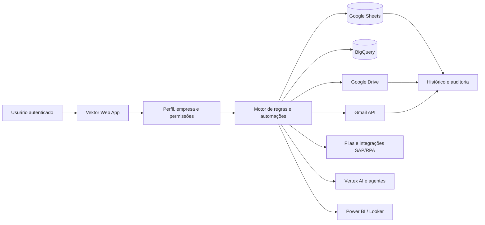

# 🧭 Vektor

**Ecossistema de governança financeira, automação operacional, dados e inteligência artificial desenvolvido em Google Apps Script.**

O Vektor reúne em um único portal rotinas que antes dependiam de planilhas separadas, consultas manuais, caixas de e-mail, arquivos no Drive, relatórios externos e diferentes ferramentas operacionais. Cada frente funciona como um módulo, mas compartilha autenticação, perfis de acesso, navegação, integrações e padrões de auditoria.

> Esta é uma versão pública e sanitizada. A estrutura e o código dos 19 arquivos do Apps Script foram preservados, enquanto IDs, e-mails, URLs internas, credenciais, dados operacionais e o conteúdo da política corporativa foram removidos ou substituídos por parâmetros de configuração.

## 📌 O problema que o Vektor resolve

Operações financeiras costumam distribuir suas atividades entre diversas fontes: transações de cartão, planilhas de lojas, consultas SAP, documentos recebidos por e-mail, bases analíticas, pastas no Drive e relatórios gerenciais. Essa fragmentação cria alguns problemas recorrentes:

- dificuldade para saber qual fonte contém a informação correta;
- execução manual das mesmas consultas e comunicações;
- controles de acesso diferentes em cada planilha;
- risco de reenvio, duplicidade ou perda de documentos;
- pouca visibilidade sobre jobs em andamento e falhas;
- dependência de pessoas específicas para operar processos;
- baixa rastreabilidade entre análise, decisão e ação.

## ✅ A solução

O Vektor atua como uma camada central entre o usuário e os serviços corporativos. O portal identifica quem está acessando, carrega apenas os módulos autorizados e oferece fluxos guiados para consultar, analisar, revisar e executar ações.

Em uma operação típica:

1. O usuário entra no Web App com sua conta corporativa.
2. O backend identifica o perfil, a empresa e os módulos permitidos.
3. A interface apresenta somente funções liberadas para aquele contexto.
4. O backend consulta Sheets, BigQuery, Drive, Gmail ou outra fonte configurada.
5. Regras determinísticas normalizam e analisam os dados.
6. O usuário recebe tabelas, indicadores, gráficos ou uma prévia da ação.
7. Quando há uma ação transacional, o usuário confirma o que será executado.
8. O resultado, o status e as evidências são registrados para acompanhamento.



## 🧩 Visão dos módulos

| Módulo | O que resolve | Principais entregas |
| --- | --- | --- |
| **Governança Clara** | Centraliza consultas e controles sobre transações do cartão corporativo | Pendências, limites, ciclos, faturas, lojas ofensoras, alertas, exportações e comunicações |
| **Assistente de Política** | Ajuda o usuário a consultar regras da política autorizada | Respostas com contexto recuperado, histórico, seções de referência e medição de tokens |
| **Numerário** | Organiza dados, solicitações SAP e comunicação com lojas | Fila de extração, acompanhamento de jobs, envios, relatórios, respostas e backups |
| **AR / Prosegur** | Controla a entrada e o processamento de documentos recebidos por e-mail | Download sem duplicidade, auditoria, status do job, indicadores e relatórios periódicos |
| **POS** | Consolida operação de lojas, importações SAP e comunicações | Cadastro, enriquecimento, envio controlado, relatórios e análise assistida pelo agente Pedro |
| **Agentes de IA** | Reúne atalhos para agentes aprovados | Catálogo central, orientação de acesso e abertura controlada dos agentes |
| **Business Intelligence** | Exibe painéis externos dentro da experiência do portal | Incorporação de relatórios Power BI ou acesso a visões analíticas configuradas |

Consulte [Módulos e fluxos operacionais](docs/modulos.md) para a descrição completa de cada frente.

## 🗺️ Páginas e módulos do sistema

O Vektor foi construído como um portal com páginas especializadas. O hub principal organiza o acesso; cada página possui suas próprias funções, fontes de dados e regras de permissão. O mapa abaixo descreve o que o usuário encontra em cada parte da aplicação.

### 🏠 Hub principal

É a porta de entrada do ecossistema. Após identificar o usuário, o perfil e os módulos autorizados, apresenta quatro caminhos principais:

| Card do hub | O que abre | Finalidade |
| --- | --- | --- |
| **Gestão do Cartão Clara** | Portal financeiro e menu de governança Clara | Consultar transações, pendências, limites, faturas, alertas e análises |
| **Agentes de IA** | Catálogo corporativo de agentes | Orientar o acesso e abrir somente os agentes liberados |
| **Business Intelligence Hub** | Página de relatório incorporado | Centralizar dashboards executivos sem retirar o usuário do Vektor |
| **Automações** | Central RPA/APA | Acessar Prosegur, Robô Vektor, Numerário e Envio POS |

O hub também exibe o usuário e o papel ativo, oculta módulos sem permissão e mantém uma navegação de retorno entre as diferentes páginas.

### 💳 Gestão do Cartão Clara

Esta é a página mais ampla do sistema e usa `Code.gs` e `index.html`. O menu lateral muda conforme o perfil do usuário e reúne:

| Página ou função | O que faz |
| --- | --- |
| **Analista - Vektor** | Assistente de política que recupera trechos autorizados, responde com contexto e registra referências e consumo de tokens |
| **Estado Operacional** | Mostra atualização da base, saúde geral e, para administradores, jobs, usuários ativos, Google, BigQuery, Vertex AI, modelo, tokens e custo |
| **Pendências do Ciclo** | Resume recibos e justificativas pendentes no ciclo, com visão por empresa, loja e responsável |
| **Análise de Gastos** | Investiga transações, estabelecimentos, categorias, itens, frequência, valores e padrões de consumo |
| **Fluxograma** | Explica visualmente o processo e orienta o usuário sobre as etapas do controle Clara |
| **Alertas Programados** | Permite criar e acompanhar alertas por escopo, loja, time, conta, etiqueta ou regra configurada |
| **Disparo de Ocorrências** | Exibe a rastreabilidade de alertas enviados, como limite, pendência e possível irregularidade |
| **Radar de Irregularidade** | Prioriza casos por critérios explícitos e apresenta score, recorrência, pendência, frequência e impacto financeiro; serve como apoio à análise humana |
| **Envio de Pendências** | Agrupa casos, prepara a prévia por loja ou responsável, envia após confirmação e evita reenvios pela chave de controle |
| **Consultas Auxiliares** | Reúne consultas de apoio para conferência e investigação de registros específicos |
| **Fluxo Numerário SAP** | Acompanha solicitações, filas e resultados de integrações ligadas ao numerário e ao SAP |
| **Custo Vertex** | Consolida chamadas, tokens, estimativa de custo e informações da última execução de IA |

O mesmo núcleo contém rotinas de comparação de faturas e ciclos, limites e saldos, lojas ofensoras, preparação de arquivos ZFI, rateios, estornos e exportações CSV/XLSX.

### 🤖 Assistente de Política

O assistente usa a política autorizada presente em `policy_clara_source.html`. A pergunta passa por seleção de trechos relevantes antes da chamada ao Vertex AI; a resposta retorna com as seções utilizadas. O módulo mantém histórico curto, mede tokens e custo estimado e não consulta documentos externos à fonte configurada.

### ⚙️ Central de Automações

A página **Automação | Central Operacional** organiza quatro frentes:

| Frente | O que o usuário encontra |
| --- | --- |
| **Automatização Prosegur** | Execução da rotina de documentos, andamento por etapa, auditoria e indicadores por empresa e período |
| **Robô Vektor** | Acionamento controlado do robô local da Clara, fila RPA, progresso, mensagem do watcher e caminho do log |
| **Numerário** | Tratativa de divergências, disparos, bases de lojas, relatórios e configurações de recuperação |
| **Envio POS** | Gestão de pendências POS, lojas, extração SAP, comunicações, relatórios e agente de análise |

### 📄 AR / Automatização Prosegur

A página de Contas a Receber concentra a captura e o acompanhamento de documentos Prosegur:

- **Centro operacional:** inicia o job e acompanha status, percentual, etapa, duração e estimativa de término.
- **Cards de fila:** mostra e-mails elegíveis, mensagens pendentes no marcador, arquivos na pasta de destino e processados no mês.
- **Manifesto de auditoria:** lista os registros mais recentes do JSON de auditoria, com data, assunto, status e anexos.
- **Linha do tempo:** apresenta os eventos da execução atual para facilitar diagnóstico e retomada.
- **Métricas do lote:** contabiliza e-mails vistos, arquivos salvos, duplicidades ignoradas e threads processadas.
- **Indicadores Prosegur:** filtra última execução ou base completa por empresa e período, exibindo documentos, valor total, geração, gráficos e tabela detalhada.
- **Relatório mensal:** pode ser instalado ou removido por acionador e distribuído conforme a configuração da implantação.

O backend preserva duas implementações: `AR_Prosegur_V2.gs`, baseada nos serviços clássicos do Apps Script, e `AR_PROSEGUR_GMAIL_API.gs`, com Gmail API, lotes, heartbeat e estado detalhado. A implantação deve escolher uma única rota operacional.

### 🦾 Robô Vektor / Clara RPA

Esta página cria uma solicitação na fila `RPA` com o tipo de robô e o status inicial. Um watcher Python local consome a solicitação, executa a rotina autorizada e devolve progresso, horários, mensagem, resultado e referência do log. A tela permite acionar o robô e atualizar o acompanhamento sem expor credenciais da máquina executora.

### 💵 Numerário

A página `numerario_index.html` alterna o contexto entre Centauro e Fisia e contém quatro módulos visuais:

| Página interna | Detalhamento |
| --- | --- |
| **Disparos** | Pesquisa e filtra divergências, permite inclusão em lote, edição, exclusão controlada, seleção de pendências e envio de comunicações |
| **Bases de Lojas** | Exibe o cadastro compartilhado de lojas usado para roteamento e preenchimento operacional |
| **Configurações** | Mantém remetente, nome, cópia, reply-to e limite por execução; também controla backup automático, periodicidade, integridade, execução imediata e acesso à pasta de recuperação |
| **Relatórios** | Consolida disparos, pendências, divergências e erros com filtros por time, loja e empresa |

O backend `vektor_numerario_email.gs` persiste dados, configurações e histórico, processa respostas e integra comunicações. `VektorNumerarioTioPatinhas.gs` faz a ponte assíncrona com o agente externo **Tio Patinhas**, registrando a solicitação e consultando o resultado sem bloquear a página.

### 📨 Envio POS

A página `pos_index.html` também separa Centauro e Fisia e possui seis módulos:

| Página interna | Detalhamento |
| --- | --- |
| **Disparos** | Filtra por loja, NSU, assunto e status, salva alterações e envia somente as linhas selecionadas e validadas |
| **Lojas** | Mantém cadastro e roteamento; permite sincronizar novas lojas, editar o contexto autorizado e restaurar a base configurada |
| **Export SAP** | Recebe empresa, conta e período, aciona o robô local da transação ZFI114, acompanha o terminal e recupera a última base salva |
| **Configurações** | Define remetente, cópia, limite por execução e parâmetros protegidos do provedor de IA |
| **Agente POS** | Analisa período e empresa, calcula sinais determinísticos, recorrência, pendências, ausência de NSU, diferença acumulada e possíveis duplicidades, depois produz recomendações sem alterar a grade |
| **Relatórios** | Apresenta panorama, KPIs, rankings e comparação entre empresas, com foco em registros pendentes e em tratamento |

O painel **Cost & Perf.** acompanha solicitações do agente, tokens, custo estimado em USD e BRL, latência média, P95, visão diária e evolução mensal.

### 🧠 Agentes de IA

Esta página apresenta o fluxo interno de liberação e um catálogo carregado pelo backend. Cada card informa nome, descrição e orientação e abre o ambiente correspondente somente quando há um agente configurado e autorizado. O Vektor funciona como ponto de descoberta; as bases e o processamento de cada agente permanecem no ambiente próprio.

### 📊 Business Intelligence Hub

A página valida a permissão no backend, recupera a URL configurada e incorpora o relatório em um `iframe`. Ela informa o estado de carregamento e permite retornar ao hub. A autenticação Microsoft ou Power BI pode ser solicitada pelo próprio relatório, sem armazenar essa credencial no Vektor.

### 🛡️ Páginas e fontes de apoio

- **`politica_dados.html`:** comunica finalidade, tratamento e regras de uso dos dados dentro do portal.
- **`policy_clara_source.html`:** contém exclusivamente a política autorizada usada pelo assistente de RAG.
- **`vektor_system_source.html`:** descreve capacidades, módulos e orientações que ajudam o sistema a interpretar solicitações e conduzir a navegação.

## 🧰 Capacidades do núcleo financeiro

Além da navegação e do controle de acesso, o núcleo do Vektor possui rotinas para:

- analisar transações por empresa, loja, time, categoria, estabelecimento e etiqueta;
- acompanhar recibos, justificativas e transações recusadas;
- identificar lojas com recorrência de pendências;
- controlar limites, saldos, ajustes e alertas preventivos;
- comparar faturas, ciclos e comportamentos por período;
- priorizar possíveis irregularidades com critérios explícitos;
- criar alertas individuais e programados;
- gerar arquivos CSV/XLSX e relatórios para envio;
- preparar arquivo contábil para fluxos ZFI, com rateios e tratamento de estornos;
- analisar itens de gasto com catálogo e regras de classificação;
- acompanhar fluxos SAP relacionados a numerário e sangrias;
- registrar métricas operacionais e custos de uso do Vertex AI.

As análises operacionais são baseadas em regras determinísticas. Inteligência artificial é utilizada somente em módulos explicitamente identificados, como o Assistente de Política e o agente Pedro do POS.

## 🏗️ Arquitetura técnica

O sistema é uma aplicação web serverless hospedada no Google Apps Script:

- **Backend:** arquivos `.gs` com regras, APIs, consultas, filas, tarefas agendadas e integrações.
- **Frontend:** páginas `.html` com JavaScript, CSS, componentes, tabelas, gráficos e navegação.
- **Comunicação interna:** `google.script.run` entre navegador e funções do Apps Script.
- **Endpoints:** `doGet()` entrega as páginas e direciona módulos; rotas de API tratam integrações autorizadas.
- **Persistência:** Sheets, arquivos JSON no Drive, propriedades do script e BigQuery.
- **Processamento assíncrono:** jobs em lotes, propriedades de status, gatilhos temporizados e polling no frontend.
- **Segurança:** sessão, lista de usuários, perfis, acesso por módulo e autorização por função.

Leia [Arquitetura do ecossistema](docs/arquitetura.md) para os componentes, padrões de execução e decisões técnicas.

## 🔌 Serviços e por que são usados

| Serviço | Uso no Vektor |
| --- | --- |
| **Google Sheets** | Bases operacionais, perfis, filas, históricos, parâmetros e métricas |
| **Google Drive** | Documentos, arquivos JSON, relatórios, auditorias e cópias de recuperação |
| **Gmail API** | Leitura controlada de mensagens, tratamento de marcadores e envio de comunicações |
| **BigQuery** | Consultas analíticas e enriquecimento de informações em maior escala |
| **Vertex AI** | Assistente de política e capacidades de IA governadas |
| **Google Docs** | Leitura ou geração de conteúdo documental em fluxos específicos |
| **Apps Script Triggers** | Execuções agendadas, retomada de jobs e monitoramentos recorrentes |
| **Power BI / Looker Studio** | Exposição de relatórios e painéis já existentes |
| **SAP / RPA** | Solicitação de extrações, intercâmbio por filas e consumo de resultados |

O manifesto declara os serviços avançados **BigQuery**, **VertexAI**, **Drive**, **Gmail** e **Sheets**. O projeto também referencia as bibliotecas Apps Script `AutomationNum1` e `Maker_PDF`.

## 📁 Estrutura do projeto

```text
vektor/
├── src/                              # cópia sanitizada do Apps Script
│   ├── appsscript.json               # manifesto, escopos, serviços e bibliotecas
│   ├── Code.gs                       # núcleo, acesso, Clara, alertas, SAP e IA
│   ├── index.html                    # portal principal e experiência conversacional
│   ├── politica_dados.html           # página de política e uso de dados
│   ├── policy_clara_source.html      # fonte configurável da política corporativa
│   ├── vektor_system_source.html     # contexto funcional usado pelo sistema
│   ├── vektor_modulo_powerbi.gs
│   ├── vektor_modulo_powerbi_htm.html
│   ├── vektor_modulo_agentes_ia.gs
│   ├── vektor_modulo_agentes_ia_htm.html
│   ├── vektor_modulo_ar.gs
│   ├── vektor_modulo_ar_htm.html
│   ├── AR_Prosegur_V2.gs
│   ├── AR_PROSEGUR_GMAIL_API.gs
│   ├── numerario_index.html
│   ├── vektor_numerario_email.gs
│   ├── VektorNumerarioTioPatinhas.gs
│   ├── vektor_pos.gs
│   └── pos_index.html
├── docs/
│   ├── arquitetura.md
│   ├── modulos.md
│   ├── dados-integracoes.md
│   ├── configuracao.md
│   └── seguranca.md
└── README.md
```

### 🧱 Responsabilidade de cada grupo de arquivos

| Arquivos | Responsabilidade |
| --- | --- |
| `Code.gs` + `index.html` | Núcleo compartilhado, autenticação, governança Clara, análises, alertas e navegação principal |
| `policy_clara_source.html` | Conteúdo que alimenta a recuperação de contexto do assistente de política |
| `politica_dados.html` | Transparência sobre dados e regras de uso |
| `vektor_system_source.html` | Base descritiva de capacidades do ecossistema |
| `vektor_modulo_ar*` | Página de Contas a Receber, analytics, RPA e relatórios Prosegur |
| `AR_Prosegur_V2.gs` | Implementação de processamento Prosegur baseada nos serviços clássicos do Apps Script |
| `AR_PROSEGUR_GMAIL_API.gs` | Implementação com Gmail API, processamento em lotes e controle detalhado de estado |
| `vektor_numerario_email.gs` + `numerario_index.html` | Operação completa do Numerário V2 |
| `VektorNumerarioTioPatinhas.gs` | Ponte com o agente externo de Numerário |
| `vektor_pos.gs` + `pos_index.html` | Operação POS, cadastro, SAP, e-mails, relatórios e agente Pedro |
| `vektor_modulo_agentes_ia*` | Catálogo visual de agentes autorizados |
| `vektor_modulo_powerbi*` | Configuração e renderização de painel incorporado |

## 🗃️ Dados e persistência

### 📊 Planilhas operacionais desta implantação

- [**Vektor_Info_calibrate**](https://docs.google.com/spreadsheets/d/18yAuYoAR33JOagqapxgwHh86F1WeD0mZcj9AIJym07k/edit?gid=1670513007#gid=1670513007): base compartilhada de apoio ao ecossistema. Mantém métricas de uso, custos estimados do Vertex AI, alertas configurados e executados, log de alertas, notificações de desligamento e registros da ponte RPA.
- [**Capta_Clara**](https://docs.google.com/spreadsheets/d/1_XW0IqbYjiCPpqtwdEi1xPxDlIP2MSkMrLGbeinLIeI/edit?gid=1277104230#gid=1277104230): base dedicada exclusivamente ao módulo **Clara**. Reúne transações do cartão corporativo, limites, pendências, históricos de comunicação, parâmetros, acessos do módulo, integrações SAP e registros do assistente de política.

Os links identificam as fontes usadas pela implantação atual. O conteúdo das planilhas não é copiado para o repositório; o acesso continua sujeito às permissões do Google Drive. Em uma nova implantação, crie bases equivalentes e substitua os IDs nas propriedades do Apps Script.

O repositório não contém nenhuma base real. Cada implantação precisa criar e configurar suas próprias fontes:

- planilhas de transações, perfis, módulos e permissões;
- tabelas de filas e status de integrações;
- pastas de documentos e arquivos JSON;
- tabelas BigQuery e projetos de faturamento;
- histórico do assistente e métricas de uso;
- configurações de e-mail, painéis e endpoints externos.

O mapa completo de fontes, leituras, gravações e responsabilidades está em [Dados e integrações](docs/dados-integracoes.md).

## 🔐 Segurança e governança

O desenho do Vektor utiliza controles em várias camadas:

- autenticação pela conta Google;
- lista de usuários autorizados;
- perfil funcional e empresa atual;
- liberação por módulo;
- autorização por função do backend;
- sessão com expiração;
- confirmação antes de ações sensíveis;
- deduplicação de documentos e comunicações;
- histórico de execução e trilha de auditoria;
- segredos e IDs separados do código público.

Os escopos do manifesto são amplos porque o ecossistema acessa diversos serviços. Antes de reutilizar o projeto, revise os módulos escolhidos e reduza os escopos ao mínimo necessário. Consulte [Segurança da versão pública](docs/seguranca.md).

## 🚀 Como adaptar para outro ambiente

1. Defina quais módulos serão usados na nova organização.
2. Crie as planilhas, pastas, tabelas e projetos Google Cloud necessários.
3. Crie um projeto Google Apps Script e copie os arquivos de `src/`.
4. Substitua os marcadores das bibliotecas no `appsscript.json` por IDs autorizados.
5. Habilite somente os serviços avançados e APIs necessários.
6. Cadastre IDs, e-mails, endpoints e segredos nas propriedades do script.
7. Configure domínios, usuários, perfis, módulos e funções permitidas.
8. Insira uma política autorizada em `policy_clara_source.html`, caso o assistente seja utilizado.
9. Valide cada módulo com bases e destinatários de teste.
10. Instale os acionadores escolhidos e publique o Web App para o público correto.

O roteiro detalhado está em [Configuração para uma nova implantação](docs/configuracao.md).

## 📚 Documentação

- [Arquitetura do ecossistema](docs/arquitetura.md)
- [Módulos e fluxos operacionais](docs/modulos.md)
- [Dados e integrações](docs/dados-integracoes.md)
- [Configuração para uma nova implantação](docs/configuracao.md)
- [Segurança da versão pública](docs/seguranca.md)

---

Desenvolvido por [Rodrigo Lisboa](https://github.com/rodrigolisboa25-create).
