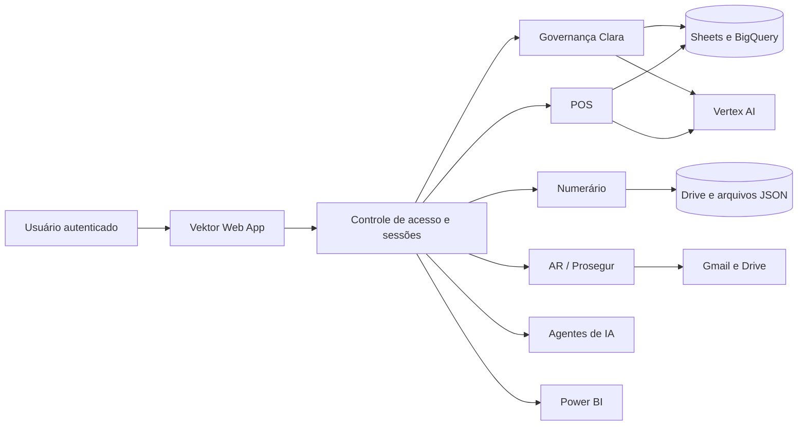

# Vektor

Ecossistema web desenvolvido em Google Apps Script para reunir governança financeira, automações operacionais, análises, assistentes de IA e páginas especializadas em uma única aplicação.

O Vektor funciona como um portal modular. O backend centraliza autenticação, perfis de acesso, regras, integrações e tarefas agendadas; as páginas HTML entregam as experiências de cada frente. A comunicação entre as camadas usa `google.script.run`.

## O que o projeto reúne

- **Governança do cartão corporativo:** consulta e análise de transações, pendências, limites, indicadores e alertas.
- **Assistente de política:** respostas apoiadas em trechos autorizados da política corporativa, usando Vertex AI e recuperação de contexto.
- **Numerário:** consolidação de dados, solicitações de extração SAP, comunicação com lojas, históricos, relatórios e backups.
- **Contas a Receber / Prosegur:** captura de anexos do Gmail, deduplicação, auditoria, acompanhamento do processamento e integração com RPA.
- **POS:** gestão de lojas e registros, importação SAP, envios controlados, relatórios e análises assistidas por IA.
- **Agentes de IA:** catálogo central para acesso aos agentes disponibilizados pela organização.
- **Power BI:** módulo para incorporar painéis autorizados dentro do portal.



## Tecnologias e serviços

**Google Apps Script V8** · **JavaScript** · **HTML/CSS** · **Google Sheets** · **Google Drive** · **Gmail API** · **BigQuery** · **Vertex AI** · **Google Docs** · **Power BI**

O manifesto registra os serviços avançados **BigQuery**, **VertexAI**, **Drive**, **Gmail** e **Sheets**. O projeto original também referencia as bibliotecas Apps Script `AutomationNum1` e `Maker_PDF`; seus identificadores foram removidos desta versão pública e devem ser informados pela nova implantação.

## Estrutura

```text
vektor/
├── src/
│   ├── appsscript.json
│   ├── Code.gs
│   ├── index.html
│   ├── politica_dados.html
│   ├── policy_clara_source.html
│   ├── vektor_system_source.html
│   ├── vektor_modulo_powerbi.gs
│   ├── vektor_modulo_powerbi_htm.html
│   ├── vektor_modulo_agentes_ia.gs
│   ├── vektor_modulo_agentes_ia_htm.html
│   ├── vektor_modulo_ar.gs
│   ├── vektor_modulo_ar_htm.html
│   ├── AR_Prosegur_V2.gs
│   ├── AR_PROSEGUR_GMAIL_API.gs
│   ├── numerario_index.html
│   ├── vektor_numerario_email.gs
│   ├── VektorNumerarioTioPatinhas.gs
│   ├── vektor_pos.gs
│   └── pos_index.html
├── docs/
│   ├── arquitetura.md
│   ├── configuracao.md
│   └── seguranca.md
└── README.md
```

Os **19 arquivos** do projeto Apps Script estão representados em `src/`. As bibliotecas vinculadas não fazem parte do código-fonte do Vektor; o repositório preserva seus nomes e documenta como configurá-las.

## Como adaptar para outro ambiente

1. Crie um projeto no Google Apps Script.
2. Copie os arquivos de `src/`, preservando seus nomes.
3. Habilite os serviços avançados descritos no manifesto.
4. Adicione as bibliotecas necessárias com versões compatíveis.
5. Cadastre IDs, e-mails, URLs e projetos nas **Propriedades do script**.
6. Substitua o conteúdo de `policy_clara_source.html` pela política autorizada para o novo ambiente.
7. Crie as planilhas, pastas e bases próprias da implantação.
8. Valide os perfis de acesso, acionadores, APIs e envios em um ambiente de teste.
9. Publique como Aplicativo da Web com o nível de acesso adequado à organização.

Leia [Arquitetura do ecossistema](docs/arquitetura.md), [Configuração para uma nova implantação](docs/configuracao.md) e [Segurança da versão pública](docs/seguranca.md).

---

Desenvolvido por [Rodrigo Lisboa](https://github.com/rodrigolisboa25-create).
