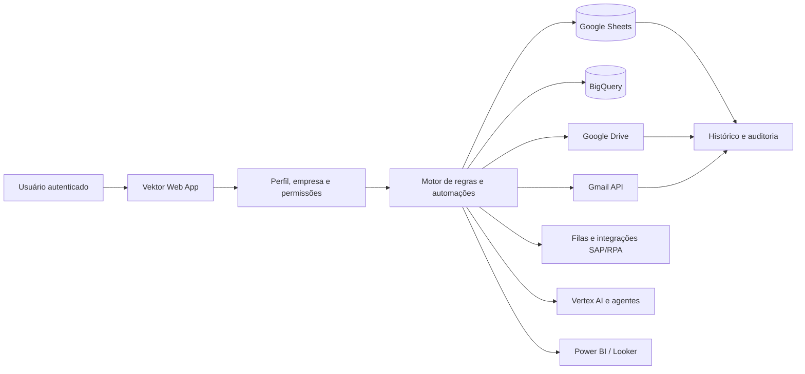

# Vektor

**Ecossistema de governança financeira, automação operacional, dados e inteligência artificial desenvolvido em Google Apps Script.**

O Vektor reúne em um único portal rotinas que antes dependiam de planilhas separadas, consultas manuais, caixas de e-mail, arquivos no Drive, relatórios externos e diferentes ferramentas operacionais. Cada frente funciona como um módulo, mas compartilha autenticação, perfis de acesso, navegação, integrações e padrões de auditoria.

> Esta é uma versão pública e sanitizada. A estrutura e o código dos 19 arquivos do Apps Script foram preservados, enquanto IDs, e-mails, URLs internas, credenciais, dados operacionais e o conteúdo da política corporativa foram removidos ou substituídos por parâmetros de configuração.

## O problema que o Vektor resolve

Operações financeiras costumam distribuir suas atividades entre diversas fontes: transações de cartão, planilhas de lojas, consultas SAP, documentos recebidos por e-mail, bases analíticas, pastas no Drive e relatórios gerenciais. Essa fragmentação cria alguns problemas recorrentes:

- dificuldade para saber qual fonte contém a informação correta;
- execução manual das mesmas consultas e comunicações;
- controles de acesso diferentes em cada planilha;
- risco de reenvio, duplicidade ou perda de documentos;
- pouca visibilidade sobre jobs em andamento e falhas;
- dependência de pessoas específicas para operar processos;
- baixa rastreabilidade entre análise, decisão e ação.

## A solução

O Vektor atua como uma camada central entre o usuário e os serviços corporativos. O portal identifica quem está acessando, carrega apenas os módulos autorizados e oferece fluxos guiados para consultar, analisar, revisar e executar ações.

Em uma operação típica:

1. O usuário entra no Web App com sua conta corporativa.
2. O backend identifica o perfil, a empresa e os módulos permitidos.
3. A interface apresenta somente funções liberadas para aquele contexto.
4. O backend consulta Sheets, BigQuery, Drive, Gmail ou outra fonte configurada.
5. Regras determinísticas normalizam e analisam os dados.
6. O usuário recebe tabelas, indicadores, gráficos ou uma prévia da ação.
7. Quando há uma ação transacional, o usuário confirma o que será executado.
8. O resultado, o status e as evidências são registrados para acompanhamento.



## Visão dos módulos

| Módulo | O que resolve | Principais entregas |
| --- | --- | --- |
| **Governança Clara** | Centraliza consultas e controles sobre transações do cartão corporativo | Pendências, limites, ciclos, faturas, lojas ofensoras, alertas, exportações e comunicações |
| **Assistente de Política** | Ajuda o usuário a consultar regras da política autorizada | Respostas com contexto recuperado, histórico, seções de referência e medição de tokens |
| **Numerário** | Organiza dados, solicitações SAP e comunicação com lojas | Fila de extração, acompanhamento de jobs, envios, relatórios, respostas e backups |
| **AR / Prosegur** | Controla a entrada e o processamento de documentos recebidos por e-mail | Download sem duplicidade, auditoria, status do job, indicadores e relatórios periódicos |
| **POS** | Consolida operação de lojas, importações SAP e comunicações | Cadastro, enriquecimento, envio controlado, relatórios e análise assistida pelo agente Pedro |
| **Agentes de IA** | Reúne atalhos para agentes aprovados | Catálogo central, orientação de acesso e abertura controlada dos agentes |
| **Business Intelligence** | Exibe painéis externos dentro da experiência do portal | Incorporação de relatórios Power BI ou acesso a visões analíticas configuradas |

Consulte [Módulos e fluxos operacionais](docs/modulos.md) para a descrição completa de cada frente.

## Capacidades do núcleo financeiro

Além da navegação e do controle de acesso, o núcleo do Vektor possui rotinas para:

- analisar transações por empresa, loja, time, categoria, estabelecimento e etiqueta;
- acompanhar recibos, justificativas e transações recusadas;
- identificar lojas com recorrência de pendências;
- controlar limites, saldos, ajustes e alertas preventivos;
- comparar faturas, ciclos e comportamentos por período;
- priorizar possíveis irregularidades com critérios explícitos;
- criar alertas individuais e programados;
- gerar arquivos CSV/XLSX e relatórios para envio;
- preparar arquivo contábil para fluxos ZFI, com rateios e tratamento de estornos;
- analisar itens de gasto com catálogo e regras de classificação;
- acompanhar fluxos SAP relacionados a numerário e sangrias;
- registrar métricas operacionais e custos de uso do Vertex AI.

As análises operacionais são baseadas em regras determinísticas. Inteligência artificial é utilizada somente em módulos explicitamente identificados, como o Assistente de Política e o agente Pedro do POS.

## Arquitetura técnica

O sistema é uma aplicação web serverless hospedada no Google Apps Script:

- **Backend:** arquivos `.gs` com regras, APIs, consultas, filas, tarefas agendadas e integrações.
- **Frontend:** páginas `.html` com JavaScript, CSS, componentes, tabelas, gráficos e navegação.
- **Comunicação interna:** `google.script.run` entre navegador e funções do Apps Script.
- **Endpoints:** `doGet()` entrega as páginas e direciona módulos; rotas de API tratam integrações autorizadas.
- **Persistência:** Sheets, arquivos JSON no Drive, propriedades do script e BigQuery.
- **Processamento assíncrono:** jobs em lotes, propriedades de status, gatilhos temporizados e polling no frontend.
- **Segurança:** sessão, lista de usuários, perfis, acesso por módulo e autorização por função.

Leia [Arquitetura do ecossistema](docs/arquitetura.md) para os componentes, padrões de execução e decisões técnicas.

## Serviços e por que são usados

| Serviço | Uso no Vektor |
| --- | --- |
| **Google Sheets** | Bases operacionais, perfis, filas, históricos, parâmetros e métricas |
| **Google Drive** | Documentos, arquivos JSON, relatórios, auditorias e cópias de recuperação |
| **Gmail API** | Leitura controlada de mensagens, tratamento de marcadores e envio de comunicações |
| **BigQuery** | Consultas analíticas e enriquecimento de informações em maior escala |
| **Vertex AI** | Assistente de política e capacidades de IA governadas |
| **Google Docs** | Leitura ou geração de conteúdo documental em fluxos específicos |
| **Apps Script Triggers** | Execuções agendadas, retomada de jobs e monitoramentos recorrentes |
| **Power BI / Looker Studio** | Exposição de relatórios e painéis já existentes |
| **SAP / RPA** | Solicitação de extrações, intercâmbio por filas e consumo de resultados |

O manifesto declara os serviços avançados **BigQuery**, **VertexAI**, **Drive**, **Gmail** e **Sheets**. O projeto também referencia as bibliotecas Apps Script `AutomationNum1` e `Maker_PDF`.

## Estrutura do projeto

```text
vektor/
├── src/                              # cópia sanitizada do Apps Script
│   ├── appsscript.json               # manifesto, escopos, serviços e bibliotecas
│   ├── Code.gs                       # núcleo, acesso, Clara, alertas, SAP e IA
│   ├── index.html                    # portal principal e experiência conversacional
│   ├── politica_dados.html           # página de política e uso de dados
│   ├── policy_clara_source.html      # fonte configurável da política corporativa
│   ├── vektor_system_source.html     # contexto funcional usado pelo sistema
│   ├── vektor_modulo_powerbi.gs
│   ├── vektor_modulo_powerbi_htm.html
│   ├── vektor_modulo_agentes_ia.gs
│   ├── vektor_modulo_agentes_ia_htm.html
│   ├── vektor_modulo_ar.gs
│   ├── vektor_modulo_ar_htm.html
│   ├── AR_Prosegur_V2.gs
│   ├── AR_PROSEGUR_GMAIL_API.gs
│   ├── numerario_index.html
│   ├── vektor_numerario_email.gs
│   ├── VektorNumerarioTioPatinhas.gs
│   ├── vektor_pos.gs
│   └── pos_index.html
├── docs/
│   ├── arquitetura.md
│   ├── modulos.md
│   ├── dados-integracoes.md
│   ├── configuracao.md
│   └── seguranca.md
└── README.md
```

### Responsabilidade de cada grupo de arquivos

| Arquivos | Responsabilidade |
| --- | --- |
| `Code.gs` + `index.html` | Núcleo compartilhado, autenticação, governança Clara, análises, alertas e navegação principal |
| `policy_clara_source.html` | Conteúdo que alimenta a recuperação de contexto do assistente de política |
| `politica_dados.html` | Transparência sobre dados e regras de uso |
| `vektor_system_source.html` | Base descritiva de capacidades do ecossistema |
| `vektor_modulo_ar*` | Página de Contas a Receber, analytics, RPA e relatórios Prosegur |
| `AR_Prosegur_V2.gs` | Implementação de processamento Prosegur baseada nos serviços clássicos do Apps Script |
| `AR_PROSEGUR_GMAIL_API.gs` | Implementação com Gmail API, processamento em lotes e controle detalhado de estado |
| `vektor_numerario_email.gs` + `numerario_index.html` | Operação completa do Numerário V2 |
| `VektorNumerarioTioPatinhas.gs` | Ponte com o agente externo de Numerário |
| `vektor_pos.gs` + `pos_index.html` | Operação POS, cadastro, SAP, e-mails, relatórios e agente Pedro |
| `vektor_modulo_agentes_ia*` | Catálogo visual de agentes autorizados |
| `vektor_modulo_powerbi*` | Configuração e renderização de painel incorporado |

## Dados e persistência

### Planilhas operacionais desta implantação

- [**Vektor_Info_calibrate**](https://docs.google.com/spreadsheets/d/18yAuYoAR33JOagqapxgwHh86F1WeD0mZcj9AIJym07k/edit?gid=1670513007#gid=1670513007): base compartilhada de apoio ao ecossistema. Mantém métricas de uso, custos estimados do Vertex AI, alertas configurados e executados, log de alertas, notificações de desligamento e registros da ponte RPA.
- [**Capta_Clara**](https://docs.google.com/spreadsheets/d/1_XW0IqbYjiCPpqtwdEi1xPxDlIP2MSkMrLGbeinLIeI/edit?gid=1277104230#gid=1277104230): base dedicada exclusivamente ao módulo **Clara**. Reúne transações do cartão corporativo, limites, pendências, históricos de comunicação, parâmetros, acessos do módulo, integrações SAP e registros do assistente de política.

Os links identificam as fontes usadas pela implantação atual. O conteúdo das planilhas não é copiado para o repositório; o acesso continua sujeito às permissões do Google Drive. Em uma nova implantação, crie bases equivalentes e substitua os IDs nas propriedades do Apps Script.

O repositório não contém nenhuma base real. Cada implantação precisa criar e configurar suas próprias fontes:

- planilhas de transações, perfis, módulos e permissões;
- tabelas de filas e status de integrações;
- pastas de documentos e arquivos JSON;
- tabelas BigQuery e projetos de faturamento;
- histórico do assistente e métricas de uso;
- configurações de e-mail, painéis e endpoints externos.

O mapa completo de fontes, leituras, gravações e responsabilidades está em [Dados e integrações](docs/dados-integracoes.md).

## Segurança e governança

O desenho do Vektor utiliza controles em várias camadas:

- autenticação pela conta Google;
- lista de usuários autorizados;
- perfil funcional e empresa atual;
- liberação por módulo;
- autorização por função do backend;
- sessão com expiração;
- confirmação antes de ações sensíveis;
- deduplicação de documentos e comunicações;
- histórico de execução e trilha de auditoria;
- segredos e IDs separados do código público.

Os escopos do manifesto são amplos porque o ecossistema acessa diversos serviços. Antes de reutilizar o projeto, revise os módulos escolhidos e reduza os escopos ao mínimo necessário. Consulte [Segurança da versão pública](docs/seguranca.md).

## Como adaptar para outro ambiente

1. Defina quais módulos serão usados na nova organização.
2. Crie as planilhas, pastas, tabelas e projetos Google Cloud necessários.
3. Crie um projeto Google Apps Script e copie os arquivos de `src/`.
4. Substitua os marcadores das bibliotecas no `appsscript.json` por IDs autorizados.
5. Habilite somente os serviços avançados e APIs necessários.
6. Cadastre IDs, e-mails, endpoints e segredos nas propriedades do script.
7. Configure domínios, usuários, perfis, módulos e funções permitidas.
8. Insira uma política autorizada em `policy_clara_source.html`, caso o assistente seja utilizado.
9. Valide cada módulo com bases e destinatários de teste.
10. Instale os acionadores escolhidos e publique o Web App para o público correto.

O roteiro detalhado está em [Configuração para uma nova implantação](docs/configuracao.md).

## Documentação

- [Arquitetura do ecossistema](docs/arquitetura.md)
- [Módulos e fluxos operacionais](docs/modulos.md)
- [Dados e integrações](docs/dados-integracoes.md)
- [Configuração para uma nova implantação](docs/configuracao.md)
- [Segurança da versão pública](docs/seguranca.md)

---

Desenvolvido por [Rodrigo Lisboa](https://github.com/rodrigolisboa25-create).
