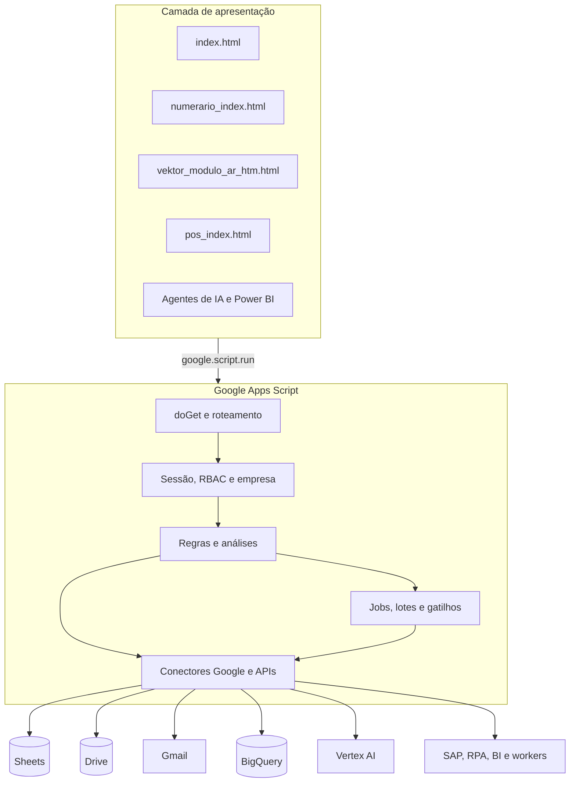

# Arquitetura do Vektor

## Visão geral

O Vektor é uma aplicação modular hospedada no Google Apps Script. `Code.gs` concentra o núcleo compartilhado e a página `index.html` fornece o portal principal. Os demais pares de arquivos `.gs` e `.html` implementam módulos especializados.

O frontend chama funções autorizadas do backend com `google.script.run`. O backend valida sessão e perfil antes de consultar bases, produzir análises ou executar uma ação transacional.

## Camadas

| Camada | Responsabilidade |
| --- | --- |
| Portal e navegação | Login, sessão, menu, páginas, componentes, gráficos e experiência conversacional |
| Controle de acesso | Lista de usuários, perfis, módulos autorizados e funções permitidas |
| Motor analítico | Normalização, filtros, consolidações, regras determinísticas, indicadores e priorizações |
| Automação | Alertas, e-mails, filas, gatilhos, integrações com RPA e rotinas programadas |
| Persistência | Google Sheets, arquivos JSON no Drive, propriedades do script e BigQuery |
| IA | Vertex AI/Gemini para respostas baseadas em contexto e análises assistidas |
| Observabilidade | Histórico, auditoria, status de jobs, métricas, custos e registros de execução |

## Fronteiras entre os componentes

- O navegador é responsável por interação, filtros, visualização e polling.
- O backend mantém regras, credenciais indiretas, consultas e autorização.
- Bases externas permanecem como fontes de verdade e não são incorporadas ao repositório.
- Jobs longos persistem o estado para sobreviver ao limite de duração de uma chamada Apps Script.
- Ações externas, como SAP e workers, usam contratos de fila ou API em vez de compartilhar memória com o Web App.

## Módulos

### Núcleo e governança Clara

`Code.gs` e `index.html` formam o portal central. Esse conjunto implementa autenticação, seleção de empresa, perfis, catálogo de funções, análises financeiras, alertas, envio assistido de pendências, histórico e o assistente de política.

### Numerário

`numerario_index.html`, `vektor_numerario_email.gs` e `VektorNumerarioTioPatinhas.gs` tratam a operação de numerário. O módulo mantém dados e configurações, solicita extrações SAP, controla comunicações, produz relatórios, cria cópias de recuperação e conversa com um agente externo autorizado.

### Contas a Receber e Prosegur

`vektor_modulo_ar.gs`, `vektor_modulo_ar_htm.html`, `AR_Prosegur_V2.gs` e `AR_PROSEGUR_GMAIL_API.gs` implementam o painel de AR, a ponte com RPA e o processamento de anexos da Prosegur. O fluxo identifica mensagens elegíveis, grava PDFs sem duplicidade, atualiza auditoria e só então finaliza o estado da mensagem no Gmail.

### POS

`vektor_pos.gs` e `pos_index.html` reúnem cadastro de lojas, registros operacionais, importação SAP, comunicação por e-mail, relatórios e análises assistidas. A persistência usa arquivos controlados no Drive e fontes analíticas configuradas para a implantação.

### Power BI e agentes de IA

Os arquivos `vektor_modulo_powerbi*` encapsulam a exibição de um painel autorizado. Os arquivos `vektor_modulo_agentes_ia*` fornecem o catálogo de agentes e seus atalhos, sempre sujeitos às permissões do portal.

## Fluxo de uma operação

1. O usuário acessa o Web App e inicia uma sessão.
2. O backend identifica o perfil e os módulos permitidos.
3. A página solicita apenas as funções liberadas para aquele perfil.
4. O backend lê as fontes configuradas e aplica regras determinísticas.
5. O frontend exibe indicadores, tabelas, gráficos ou uma prévia da ação.
6. Ações transacionais exigem a etapa de confirmação prevista no fluxo.
7. O resultado é persistido com status e evidências para consulta posterior.

## Dependências externas

- Serviços avançados do Google: BigQuery, Vertex AI, Drive, Gmail e Sheets.
- APIs e escopos OAuth declarados em `appsscript.json`.
- Bibliotecas Apps Script: `AutomationNum1` e `Maker_PDF`.
- Bases, pastas, projetos Google Cloud, painéis e agentes configurados por ambiente.

As bibliotecas são dependências vinculadas ao projeto e não arquivos internos. O repositório não replica o código delas.

## Padrões de execução

### Chamada interativa

Usada em filtros, consultas e carregamento de telas:

1. o frontend chama uma função pelo `google.script.run`;
2. o backend valida usuário, módulo e função;
3. a fonte é consultada;
4. o resultado é normalizado;
5. um objeto reduzido retorna para a tela.

### Ação transacional assistida

Usada em envios, ajustes e alterações:

1. o sistema prepara uma prévia;
2. o usuário revisa os itens;
3. o backend valida novamente a permissão;
4. a ação é executada;
5. uma chave ou histórico registra o resultado;
6. repetições são bloqueadas ou sinalizadas.

### Job em lotes

Usado quando o volume pode exceder o tempo de execução do Apps Script:

1. uma função cria o job e seu snapshot inicial;
2. cada chamada processa um lote limitado;
3. o heartbeat atualiza a última atividade;
4. a interface consulta o status;
5. o processo conclui, conclui com falhas ou expira;
6. a retomada usa o estado persistido.

### Rotina agendada

Usada em alertas, backups, sincronizações e monitoramentos. Funções de instalação criam acionadores específicos; funções de remoção permitem desativá-los sem apagar a lógica do módulo.

## Persistência por finalidade

| Necessidade | Mecanismo |
| --- | --- |
| Parâmetro ou segredo | Propriedades do script |
| Sessão e cache curto | CacheService / propriedades temporárias |
| Tabela operacional colaborativa | Google Sheets |
| Arquivo, documento ou estado estruturado | Google Drive |
| Consulta analítica de maior escala | BigQuery |
| Auditoria de documentos Prosegur | JSON no Drive |
| Progresso de job | Propriedades, planilha ou JSON conforme o módulo |

## Observabilidade

O sistema combina indicadores de interface e registros persistentes:

- status e heartbeat de jobs;
- contadores de itens processados, salvos, ignorados, duplicados e com falha;
- detalhes de erro classificados por etapa;
- histórico de comunicações;
- logs de alertas e monitoramentos;
- métricas de uso das funções;
- tokens, latência e custo estimado dos recursos de IA.

## Decisões e limites técnicos

- **Apps Script como orquestrador:** reduz infraestrutura, mas impõe quotas e limite de duração; por isso o projeto usa lotes, gatilhos e polling.
- **Sheets e JSON como persistência operacional:** facilitam manutenção, mas exigem controle de concorrência, validação e backups.
- **Múltiplos módulos no mesmo projeto:** simplifica acesso e navegação, mas torna essencial separar configurações e permissões.
- **Duas rotas Prosegur preservadas:** facilita histórico e migração, mas uma implantação deve escolher qual delas é oficial.
- **Escopos OAuth amplos:** atendem ao ecossistema completo; uma implantação parcial deve reduzi-los ao mínimo necessário.
