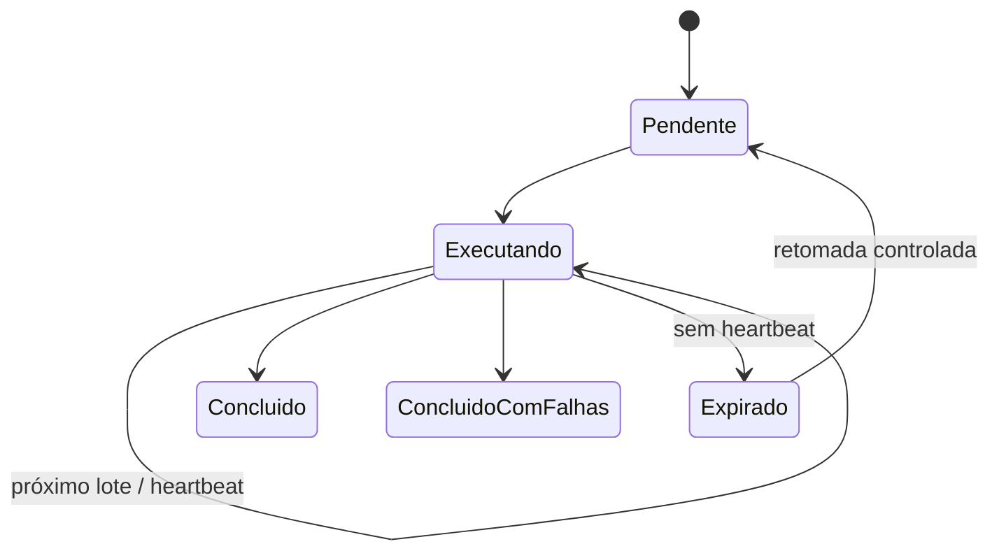

# Dados e integrações

O Vektor não depende de uma única base. Ele organiza diferentes fontes sob uma camada comum de acesso, regras e auditoria.

## Mapa de fontes

| Fonte | Conteúdo típico | Operações |
| --- | --- | --- |
| Base Clara em Sheets | Transações, status, recibos, justificativas, etiquetas e ciclos | Leitura, filtros, agregações e preparação de comunicações |
| Planilha de acesso | Usuários, perfis, empresas, módulos e funções | Leitura com cache e validação no backend |
| Planilha do Numerário | Base operacional, linhas SAP e fila de jobs | Leitura, gravação e sincronização por chave |
| Arquivos JSON do Numerário | Dados, configuração, disparos e respostas | Leitura, gravação atômica, backup e recuperação |
| Arquivos JSON do POS | Registros, lojas, configurações e estado de envio | Leitura, atualização e versionamento lógico |
| BigQuery | Estruturas de loja, dados analíticos e fontes SAP disponibilizadas | Consultas parametrizadas e enriquecimento |
| Gmail | Mensagens Prosegur, anexos e envio de comunicações | Pesquisa, leitura, envio e alteração de marcadores |
| Google Drive | PDFs, auditoria, relatórios, arquivos de intercâmbio e snapshots | Criação, busca, atualização e organização |
| Vertex AI | Geração baseada em contexto e análises assistidas | Chamada autenticada, resposta e metadados de uso |
| Power BI / Looker | Relatórios externos | Incorporação ou abertura controlada |
| Agente SAP/RPA | Extrações e tarefas fora do Apps Script | Fila, polling, retorno de status e resultado |

## Contrato de acesso

O frontend não acessa diretamente as bases. Ele chama funções do backend, que executam as seguintes etapas:

1. validação da sessão;
2. validação do módulo e da função;
3. normalização dos parâmetros;
4. leitura da fonte configurada;
5. aplicação das regras do domínio;
6. redução do resultado ao necessário para a tela;
7. registro da execução quando aplicável.

Essa separação evita expor IDs, tokens e consultas diretamente ao navegador.

## Google Sheets

As planilhas são usadas quando o processo precisa de uma base fácil de manter, auditável por usuários autorizados e integrada ao Apps Script.

Padrões presentes no projeto:

- cabeçalhos identificados por nome, evitando dependência exclusiva da posição da coluna;
- criação de abas e cabeçalhos quando necessário;
- normalização de datas, valores, empresas e códigos de loja;
- chave de negócio para atualização de registros;
- abas separadas para configuração, histórico e métricas;
- cache de leituras pequenas e frequentes, como a matriz de acesso.

## Arquivos JSON no Drive

Numerário e POS utilizam JSON como persistência leve para partes da operação. A solução inclui:

- descoberta ou criação do arquivo esperado;
- validação do JSON antes de aceitar uma gravação;
- estrutura com versão de schema;
- snapshots de recuperação;
- hashes para conferir a integridade do conteúdo;
- retenção controlada de backups.

Os arquivos reais não pertencem ao repositório. Cada implantação cria sua própria pasta e informa o ID nas propriedades do script.

## Gmail e documentos Prosegur

O módulo AR usa o Gmail como fila de entrada de documentos. Marcadores distinguem mensagens elegíveis, pendentes e processadas.

O fluxo protege a consistência em três etapas:

1. persistir o PDF;
2. persistir a auditoria;
3. finalizar o estado da mensagem.

Se a gravação falha, a mensagem não deve ser marcada como concluída. A deduplicação permite reprocessar a fila sem salvar o mesmo documento novamente.

## BigQuery

As consultas BigQuery são usadas para dados analíticos ou fontes que não devem ser copiadas integralmente para Sheets. A nova implantação precisa configurar projeto de faturamento, datasets, tabelas, permissões e limites de consulta.

Os identificadores do ambiente original foram substituídos por marcadores.

## Vertex AI

O Apps Script chama o Vertex AI usando o token OAuth da própria execução. A requisição informa projeto, região e modelo.

No Assistente de Política, somente os trechos recuperados da política seguem como contexto. A resposta retorna junto com os metadados de uso, usados para medir tokens e estimar custos.

No POS, a configuração do agente Pedro permite escolher o provedor e o modelo. Chaves e endpoints ficam em propriedades do script ou em configuração administrativa protegida.

## Filas, jobs e polling

Processos longos não devem depender de uma única chamada do navegador. O Vektor utiliza um padrão de jobs:

O frontend inicia o job e consulta o status periodicamente. O backend limita o tamanho do lote, grava o progresso e agenda continuação quando necessário.

## Auditoria

Dependendo do módulo, a evidência pode ser armazenada em:

- aba de histórico no Sheets;
- arquivo JSON de auditoria no Drive;
- propriedades temporárias do job;
- log de envio com chave de deduplicação;
- registro de métrica e custo;
- status persistido no próprio item operacional.

Uma nova implantação deve definir tempo de retenção, responsáveis pelo acesso e processo de recuperação de cada evidência.

## Dados que ficam fora do GitHub

- planilhas e tabelas reais;
- arquivos JSON de produção;
- PDFs e anexos recebidos;
- listas de usuários e destinatários;
- IDs de recursos Google;
- endpoints internos;
- chaves e tokens;
- conteúdo de políticas corporativas;
- histórico e métricas de execução.
