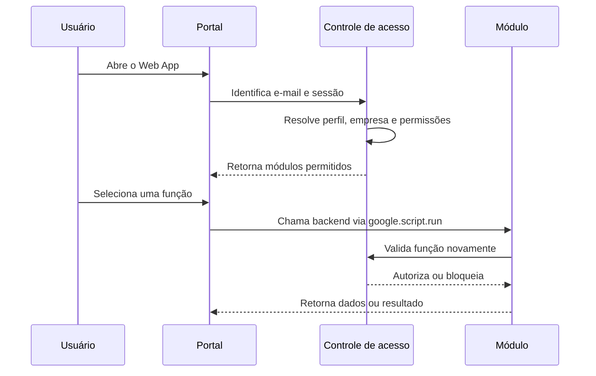
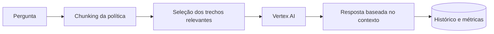
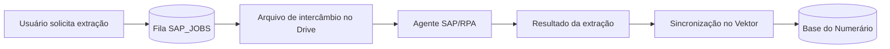

# Módulos e fluxos operacionais

Este documento descreve o papel de cada módulo do Vektor, quais informações consome, como processa os dados e o que entrega ao usuário.

## 1. Portal, autenticação e controle de acesso

O portal principal é formado por `Code.gs` e `index.html`. Antes de disponibilizar uma função, o Vektor considera quatro dimensões:

1. **Usuário:** e-mail da conta autenticada.
2. **Perfil:** papel atribuído ao usuário na matriz de acesso.
3. **Empresa:** contexto operacional selecionado ou determinado pelo cadastro.
4. **Módulo e função:** telas e ações liberadas para aquele perfil.

As abas `VEKTOR_EMAILS`, `VEKTOR_ACESSOS` e `VEKTOR_MODULOS` formam a matriz básica de autorização. O backend mantém cache curto dessas informações para reduzir leituras repetidas, mas valida funções sensíveis no servidor.

## 2. Governança do cartão corporativo

O núcleo Clara transforma a base transacional em consultas e fluxos operacionais. Ele suporta mais de um contexto de empresa e separa as respectivas fontes e regras.

### Consultas e análises

- transações por loja, time, categoria, estabelecimento e etiqueta;
- maiores transações e detalhamento individual;
- resumos por ciclo e período;
- comparação entre faturas;
- frequência de uso e itens comprados;
- relação entre saldo, limite e consumo;
- estornos e correspondência com lançamentos anteriores;
- exportação de visões para Excel ou CSV.

### Pendências e comunicação

O módulo identifica transações com recibos ou justificativas pendentes, agrupa os casos e permite preparar comunicações direcionadas.

1. O usuário escolhe período e critérios.
2. O backend consulta a base e normaliza os registros.
3. A tela mostra indicadores, distribuição e lista detalhada.
4. O usuário seleciona os casos que devem ser comunicados.
5. O sistema gera uma prévia por loja ou responsável.
6. Após confirmação, os e-mails são enviados.
7. Cada envio recebe uma chave de controle para evitar repetição.
8. O histórico fica disponível para consulta.

### Lojas ofensoras e possíveis irregularidades

O Vektor consolida recorrência, volume, valor e critérios previamente definidos para priorizar análises humanas. O resultado pode aparecer no chat, no Radar de Irregularidades ou em alertas programados.

Esses indicadores não classificam fraude e não substituem a decisão humana. Servem para direcionar atenção a cenários que atendem regras explícitas.

### Limites e saldos

As rotinas de limites podem:

- detectar saldo crítico ou redução relevante;
- preparar ajuste mensal;
- separar processamento por empresa;
- agendar a aplicação em data posterior;
- enviar alertas preventivos;
- registrar que uma comunicação já ocorreu.

Feriados, dias adicionais sem expediente e regras de data podem ser configurados para impedir execução em dias inadequados.

### Alertas programados

Usuários autorizados podem configurar alertas por tipo, escopo, loja, time, conta ou etiqueta. Um agendador percorre os alertas ativos, executa as consultas, monta anexos quando necessário e registra cada execução.

### Arquivo ZFI e análise contábil

O núcleo inclui preparação de arquivo para fluxo contábil ZFI, com:

- formatação de data e valores no padrão esperado;
- resolução de loja e centro de custo;
- identificação de estornos;
- correspondência com histórico recente;
- rateio entre lojas;
- geração de prévia e CSV final.

Há também uma análise de itens de gasto baseada em catálogo, normalização textual e regras de correspondência. O resultado pode ser exportado ou enviado por e-mail.

## 3. Assistente de Política

O assistente responde perguntas usando somente o documento configurado em `policy_clara_source.html`.

### Fluxo RAG

1. O frontend envia a pergunta e um histórico curto.
2. O backend valida a permissão da função.
3. O texto autorizado da política é carregado.
4. O conteúdo é dividido em trechos identificáveis.
5. Os trechos são ranqueados por relevância para a pergunta.
6. Apenas os melhores trechos seguem para o Vertex AI.
7. A resposta e as seções utilizadas retornam ao usuário.
8. O histórico e o consumo de tokens são registrados.

O controle de custos utiliza os metadados de uso retornados pelo modelo, acumula tokens por período e calcula uma estimativa de custo.

## 4. Numerário

O módulo de Numerário combina interface própria, persistência em Drive, integração SAP, comunicação e relatórios.

### Estrutura funcional

- cadastro e manutenção de registros operacionais;
- filtros por empresa, loja, período e status;
- criação de solicitações de extração SAP;
- acompanhamento do job até a chegada do resultado;
- importação e substituição controlada das linhas do SAP;
- seleção de registros para comunicação;
- envio pela Gmail API;
- processamento de respostas recebidas;
- relatórios consolidados;
- cópias de recuperação e restauração.

### Ponte SAP

O Apps Script grava uma solicitação em uma fila e gera um arquivo de intercâmbio. Um agente externo autenticado coleta o próximo job, executa a extração e devolve status e resultado. O Vektor sincroniza o retorno, atualiza a planilha e disponibiliza o resultado na interface.

### Persistência e recuperação

O Numerário V2 mantém arquivos JSON separados para dados, configurações e disparos. Antes de alterações relevantes, o módulo pode criar snapshots de recuperação, calcular hash SHA-256, reter uma quantidade definida de versões e agendar a próxima cópia.

### Agente Tio Patinhas

`VektorNumerarioTioPatinhas.gs` implementa a ponte com um worker externo. O Vektor envia a solicitação, recebe um identificador e consulta o resultado posteriormente, evitando manter a tela bloqueada durante o processamento.

## 5. Contas a Receber e Prosegur

O módulo AR reúne painel, analytics, fila RPA e processamento de documentos da Prosegur.

### Processamento de e-mails

1. O sistema consulta mensagens que atendem ao marcador e aos critérios definidos.
2. As mensagens elegíveis entram em um job com estado persistido.
3. O processamento ocorre em pequenos lotes para respeitar o tempo máximo do Apps Script.
4. Os anexos PDF são lidos e normalizados.
5. O arquivo é gravado somente quando ainda não existe.
6. A auditoria é atualizada no Drive.
7. Somente depois da persistência o Gmail recebe a alteração de marcadores.
8. O dashboard atualiza contagens, detalhes e erros por etapa.

### Deduplicação e estado

A prevenção de duplicidade combina hash do conteúdo, nome e tamanho. O job registra total, processados, salvos, duplicados, ignorados, falhas, etapa atual, heartbeat e detalhes. Jobs sem atualização por um período definido podem ser marcados como expirados, permitindo uma retomada segura.

### Duas implementações preservadas

O projeto contém `AR_Prosegur_V2.gs` e `AR_PROSEGUR_GMAIL_API.gs`. Elas representam implementações diferentes do mesmo domínio. A primeira utiliza serviços clássicos do Apps Script; a segunda usa a Gmail API com controle mais detalhado dos anexos e marcadores.

Em uma nova implantação, escolha uma rota como oficial e direcione o frontend apenas para ela. Não execute as duas sobre a mesma fila sem uma estratégia explícita de coordenação.

### Analytics e relatórios

O módulo produz indicadores a partir dos documentos recebidos e processados, cria gráficos para e-mail e permite instalar ou remover o acionador do relatório mensal.

## 6. POS

O módulo POS mantém uma operação separada para lojas e registros financeiros.

Principais capacidades:

- configurar pasta de armazenamento;
- carregar a base inicial e a lista de lojas;
- criar, editar e excluir registros conforme a permissão;
- sincronizar lojas diariamente;
- importar linhas do SAP;
- enriquecer registros com informações auxiliares;
- validar campos obrigatórios antes do envio;
- enviar somente linhas selecionadas;
- controlar status para impedir reenvio indevido;
- produzir relatórios por empresa e período.

### Agente Pedro

O agente Pedro analisa os registros segundo uma política versionada. O módulo aceita configuração de provedor, endpoint, modelo e chave, pode utilizar Gemini ou um endpoint compatível e registra tokens, custo estimado, latência e desempenho.

A análise combina regras locais e IA. As validações determinísticas continuam disponíveis mesmo quando o provedor de IA não está configurado.

## 7. Agentes de IA

O módulo apresenta um catálogo de agentes autorizados, com título, descrição, instrução de acesso e link. Ele não incorpora as bases dos agentes no Vektor; funciona como um ponto central de descoberta e abertura.

## 8. Business Intelligence Hub

O módulo Power BI valida a permissão e devolve os dados necessários para incorporar um relatório configurado. A URL do painel fica fora do código público e deve ser informada pela nova implantação.

## 9. Política de dados e contexto do sistema

- `politica_dados.html` explica ao usuário como o portal utiliza os dados.
- `policy_clara_source.html` contém a fonte autorizada consultada pelo assistente.
- `vektor_system_source.html` reúne o contexto funcional usado para orientar respostas e navegação.

Na versão pública, o conteúdo corporativo da política foi substituído por um marcador para impedir exposição indevida.
